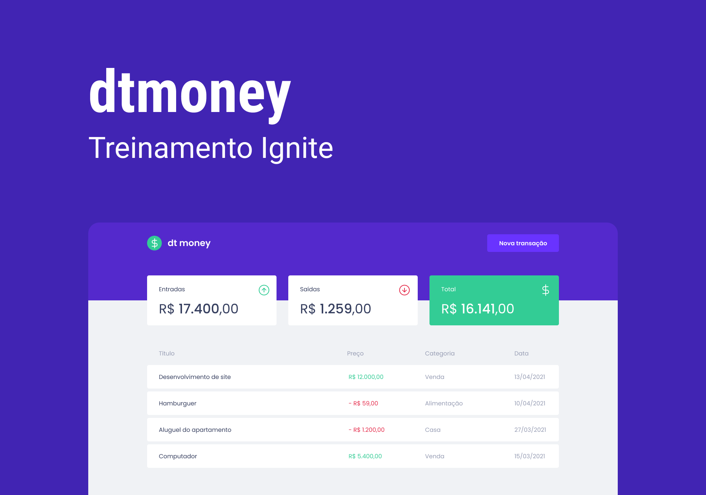

<p align="center">
  
</p>
<h3 align="center">
  Ignite training 👨🏻‍🚀 🚀
</h3>

<p align="center">
  

  
  	
  <a href="https://www.linkedin.com/in/gabriel-moraes-martins/">
    
  </a>
  
  <a href="https://github.com/gmorae/dt.money/commits/master">
    
  </a>

  
   
   <a href="https://github.com/gmorae/dt.money/stargazers">
    
  </a>
   
</p>




## 🛠 Tecnologias

This project was developed using the following technologies:

- [React][reactjs]
- [TypeScript][typescript]

## 🚀 Run the project

```bash
# Clone the project
$ git clone https://github.com/gmorae/dt.money

# Access the folder
$ cd dt.money

# Install the dependencies
$ yarn

# Start the project
$ yarn start

# The app will be available for access on your browser at http://localhost:3000
```

Made with ❤️ by Gabriel Moraes 👋🏽 [Entre em contato!](https://www.linkedin.com/in/gabriel-moraes-martins/)

[typescript]: https://www.typescriptlang.org/
[reactjs]: https://reactjs.org
